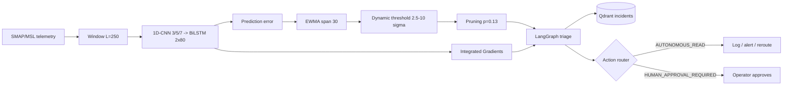

# Architecture

```mermaid
flowchart LR
  T[SMAP/MSL telemetry] --> W[Window L=250]
  W --> M[1D-CNN 3/5/7 -> BiLSTM 2x80]
  M --> E[Prediction error] --> S[EWMA span 30] --> D[Dynamic threshold 2.5-10 sigma] --> P[Pruning p=0.13]
  M --> X[Integrated Gradients]
  P --> A[LangGraph triage]
  X --> A
  A --> R[(Qdrant incidents)]
  A --> H{Action router}
  H -->|AUTONOMOUS_READ| L[Log / alert / reroute]
  H -->|HUMAN_APPROVAL_REQUIRED| O[Operator approves]
```

Fallbacks: model latency over 200 ms -> Z-score; Qdrant down -> in-memory store; no LLM key -> retrieval-only hypothesis.
